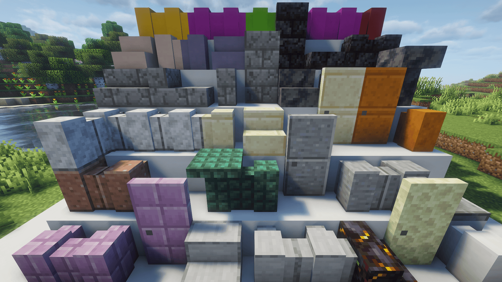

# Just Block Shapes

A Minecraft mod that adds missing wall, stairs, slab, trapdoor, door, pressure plate, and button variants for vanilla building blocks.



- **1.21.1, 1.21.3–1.21.11**: Fabric + NeoForge + Forge

## Added Blocks

Each base block receives the variant types listed below. Variants that already exist in vanilla are not duplicated.

### Wall + Trapdoor + Door + Pressure Plate + Button (stairs + slab already exist in vanilla)
Quartz, Smooth Quartz, Polished Andesite, Polished Granite, Polished Diorite, Dark Prismarine, Prismarine Bricks, Purpur, Smooth Sandstone, Smooth Red Sandstone

### Stairs + Wall + Trapdoor + Door + Pressure Plate + Button (slab already exists)
Smooth Stone, Cut Sandstone, Cut Red Sandstone

### Wall + Trapdoor + Door (pressure plate + button already exist in vanilla)
Stone

### Stairs + Slab + Wall + Trapdoor + Door + Pressure Plate + Button
Calcite, Cracked Stone Bricks, Smooth Basalt, Cracked Deepslate Bricks, Cracked Polished Blackstone Bricks, Cracked Deepslate Tiles, Cracked Nether Bricks, End Stone, Gilded Blackstone, Terracotta (plain), 16 Dyed Terracotta, 16 Concrete

**Total: ~365 new blocks**

## Installation

1. Install [Fabric Loader](https://fabricmc.net/), [NeoForge](https://neoforged.net/), or [Forge](https://files.minecraftforge.net/)
2. Install [Fabric API](https://modrinth.com/mod/fabric-api) (Fabric only)
3. Place the mod JAR in your `mods/` folder

## Building from Source

```bash
# Build
./gradlew build

# Run datagen (regenerate resources)
./gradlew fabric:runDatagen -Ptarget_mc_version=1.21.1

# Run client for testing
./gradlew fabric:runClient -Ptarget_mc_version=1.21.1
./gradlew neoforge:runClient -Ptarget_mc_version=1.21.1
./gradlew forge:runClient -Ptarget_mc_version=1.21.1
```

## License

LGPL-3.0-only
